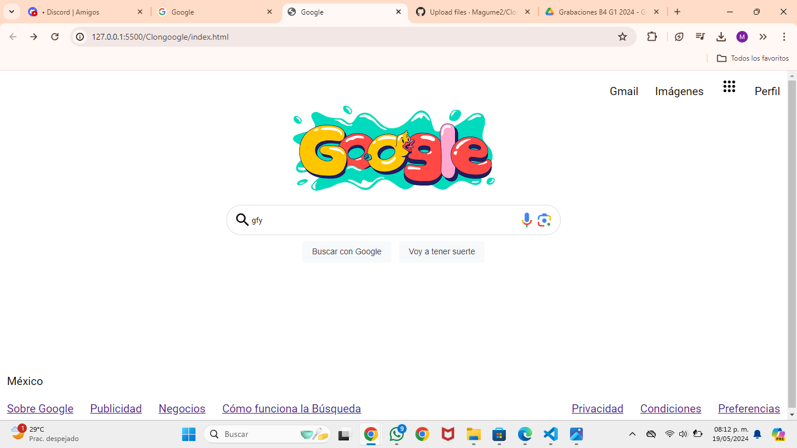

# Mi Clon de Google de Tecnolochicas PRO

Este portafolio es desarrollado para poner en practica las habilidades obtenidas dentro del bootcamp de desarrollo frontend.

Fue desarrollado con HTM, CSS y con el uso animaciones de bibliotecas externas.

[Proyecto en linea](https://clon-de-google-maria-medina.netlify.app/)

-Capturas de pantalla

-Tecnologias
*HTML
*CSS

Ocupe bibliotecas extra.

Creado por Maria Guadalupe en el bootcamp de Tecnolochicas PRO.